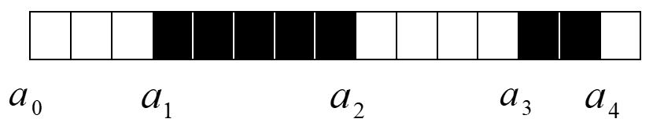

#信息隐藏第四次实验
**1410658 杨旭东**
##1. 二值图像中的信息隐藏
###1.1. 二值图像
由黑白象素的分布构成图像。
###1.2. 通常方法
利用图像区域中黑色象素的个数对秘密信息进行编码。 
##2. 二值图像信息隐藏的两种方法
###2.1. 方法一
####2.1.1. 嵌入
- 把一个二值图像分成 L(m) 个矩形图像区域 Bi ，如果其中黑色象素的个数大于一半，则表示嵌入 0 ；如果白色象素的个数大于一半，则表示嵌入 1 。
- 当需要嵌入的比特与所选区域的黑白象素的比例不一致时，为了达到希望的象素关系，则需要修改一些象素的颜色。
- 修改应遵循一定的规则，原则是不引起感观察觉。
- 修改应在黑白区域的边缘进行 。
####2.1.2. 需注意的细节
- 应考虑有一定的冗余度。确定有效区域。
- 确定两个阈值 R1 > 50% 和 R0 < 50% ，以及一个健壮性参数 λ 。隐藏 0 时，该块的黑色象素的个数应属于 [R1 , R1 + λ] 隐藏 1 时，该块的黑色象素的个数应属于 [R0 - λ , R0] 。
- 如果为了适应所嵌入的比特，目标块必须修改太多的象素，就把该块设为无效。
- 标识无效块：将无效块中的象素进行少量的修改，使得其中黑色象素的百分比大于 R1 + 3λ ，或者小于 R0 - 3λ 。
####2.1.3. 提取
- 判断每一个图像块黑色象素的百分比，如果大于 R1 + 3λ ，或者小于 R0 - 3λ ，则跳过这样的无效块。
- 如果在 [R1 , R1 + λ] 或者 [R0 - λ , R0] 的范围内，则正确提取出秘密信息 0 或 1 。
###2.2. 方法二
利用游程编码的方法，例：
<br>
编码：< a0, 3 > < a1, 5 > < a2, 4 > < a3, 2 > < a4, 1 >
####2.2.1. 嵌入
- 修改二值图像的游程长度。
- 如果秘密信息位是 0 ，则修改该游程长度为偶数；如果为 1 ，则修改游程长度为奇数；如果秘密信息的取值与游程长度的奇偶性相匹配，则不改变游程长度。
####2.2.2. 提取
- 根据游程长度的奇偶性提取出秘密信息。
##3. 代码实现与解释
使用 MATLAB 实现了第二种方法，即 `2.2.` 中的利用游程编码的方法，用 decode.m 实现秘密信息嵌入，用 encode.m 实现秘密信息提取，嵌入时用到了 str2bit 和 Vector2Matrix 两个函数做待隐藏信息的编码处理，提取时用到了 bit2str 函数解码比特串为正常字符串。
###3.1. encode.m
```MATLAB
clear all;
oi=imread('载体图片.bmp');%打开载体图像
[row col]=size(oi);
oi=oi(:);%将矩阵竖向排开变成一列
len=size(oi);

%统计游程长度
i=1;
j=1;
while i<len(1)
    or=oi(i,1);
    count=1;
    while (i<len(1)&&oi(i+1,1)==or)
        i=i+1;
        count=count+1;
    end
    RLE(j)=count;
    j=j+1;
    i=i+1;
end
if i==len(1)
    RLE(j)=1;
end
RLE=RLE';

%将秘密信息转化为二进制
msgfid=fopen('隐藏信息.txt','r');%打开秘密文件
[msg,msgcount]=fread(msgfid);
fclose(msgfid);
msg = str2bit(msg);
msg = msg';
msgcount=msgcount*8;

%利用游程编码的方法将秘密信息嵌入图片
for l=1:msgcount
    modpoint=0;
    for x=1:2*l
        modpoint=modpoint+RLE(x,1);
    end
    if msg(l,1)==0
        if ((mod(RLE(2*l,1),2)~=0)&&(RLE(2*1+1,1)~=1))
            oi(modpoint+1,1)=mod((oi(modpoint+1,1)+1),2);
        end
    else
        if ((mod(RLE(2*l,1),2)==0)&&(RLE(2*1+1,1)~=1))
            oi(modpoint+1,1)=mod((oi(modpoint+1,1)+1),2);
        end
    end
end

%存储处理后的图片
m1=Vector2Matrix(oi,row);%将数组转换成为二维矩阵
imwrite(m1,'载体图片_隐藏信息.bmp');

%显示处理前后的图片
figure;
imshow('载体图片.bmp');
title('处理前');
figure;
imshow('载体图片_隐藏信息.bmp');
title('处理后');
```
待隐藏信息保存在 `隐藏信息.txt` 中，取出信息编码为二进制比特串才能进行隐藏。为了方便处理，先将图片信息存到一维数组中对其游程的奇偶性做更改，再转换为二维数组存回图片，完成信息隐藏。
###3.2. decode.m
```MATLAB
clear all;
oi=imread('载体图片_隐藏信息.bmp'); %打开携密图像
[row col]=size(oi);
oi=oi(:);%将矩阵竖向排开变成一列
len=size(oi);

%统计游程长度
i=1;
j=1;
while i<len(1)
    or=oi(i,1);
    count=1;
    while (i<len(1)&&oi(i+1,1)==or)
        i=i+1;
        count=count+1;
    end
    RLE(j)=count;
    j=j+1;
    i=i+1;
end
if i==len(1)
    RLE(j)=1;
end
RLE=RLE';

%将游程信息提取为二进制比特串
msgcount=256;
for i=1:msgcount
    msg(i,1)=0;
end
for l=1:msgcount
    if mod(RLE((2*l),1),2)==0 
        msg(l,1)=0; %如果游程的值为偶数，表示隐藏的信息为0
    else
        msg(l,1)=1; %如果游程的值为奇数，表示隐藏的信息为1
    end
end

%将比特串解码为字符串后保存到文件
out=bit2str(msg);
fid=fopen('提取信息.txt', 'wt');
fwrite(fid, out);
fclose(fid);
```
提取与隐藏类似，但只需要对隐藏信息的载体图片的游程进行统计以获得相应的二进制比特串，之后再解码为正常的字符串即可。
###3.3. 字符串处理函数
见文件 `str2bit.m` `Vector2Matrix.m` `bit2str.m` ，分别用来：将字符串编码为比特串、将数组转换成为二维矩阵、将比特串解码为字符串，比较简单，不做详细解释。
##4. 实验结果展示
###4.1. 原始图片
>载体图片.bmp

<br>
###4.2. 待隐藏秘密信息
>隐藏信息.txt
```txt
信息安全1410658杨旭东
```
###4.3. 嵌入秘密信息后的图片
>载体图片_隐藏信息.bmp

<br>
###4.4. 从图片提取的秘密信息
>提取信息.txt
```txt
信息安全1410658杨旭东      
```